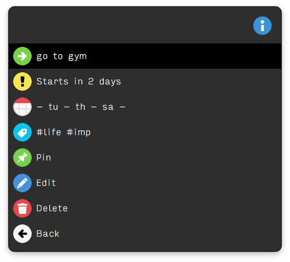

# Streaks
Streaks is a task list workflow for maintaining task streaks. A streak is the number of days a task has been active. 

It can be used as todo list that helps you to maintain a desired habit, or to keep track of outstanding ideas.

The keyword to activate the workflow is `streaks`. Once activated, you will be show your **Today List** - this is a set of tasks that are active for today.

## Usage

Type `streaks` into Alfred to activate the workflow. You will be presented with the **Today List**.

The general format of a task is `task name #tags @schedule` where tags and schedule are optional. You can type in text in the **Today List**, which allows you to create new tasks or search for existing ones.

## Example use cases

### Tracking Orders
 I just ordered a keyboard from Amazon, and I add in a task.

`keyboard #orders #pending`

This is an example of a daily task whose streak is automatically incremented every day. 

Such tasks will always appear in your **Today List**

### Gym Days
I decided to start going to the gym on specific days of the week.

`go to gym @tu,th,sa`

This is an example of a tracked task that *requires* you to confirm the task every scheduled day. In this example, `go to gym` will appear in your **Today List** every Tuesday, Thursday and Saturday.

Streaks for scheduled tasks will only be incremented when you confirm them. If you missed to confirm a scheduled task, you can restart the streak by resetting it.

